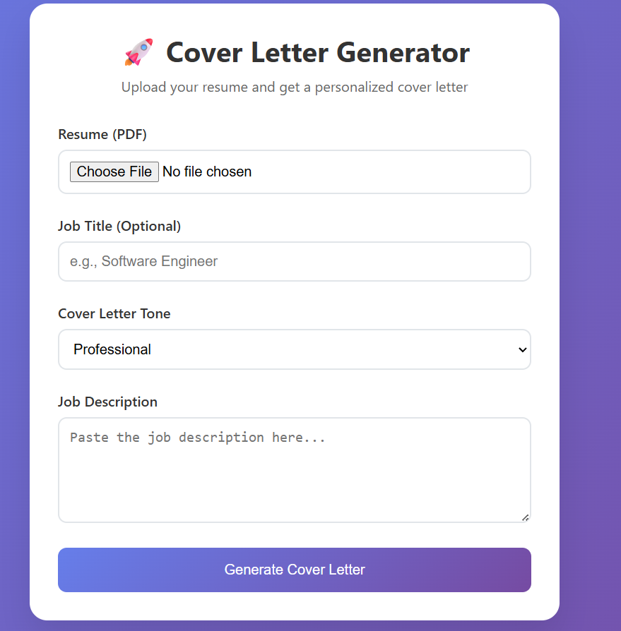

# 🚀 AI Cover Letter Generator

Generate personalized, professional cover letters instantly using AI technology. Our tool analyzes your resume and the job description to create a tailored cover letter that highlights your relevant experience and skills.

## 🌟 Try It Now!

Visit our live application: [Cover Letter Generator](https://coverletter-gen-919502020596.europe-west1.run.app/)

## ✨ Features

- **Resume Analysis**: Upload your PDF resume and let our AI understand your experience and skills
- **Job-Specific**: Enter the job description to get a perfectly tailored cover letter
- **Multiple Tones**: Choose from different writing styles:
  - Professional (formal and business-like)
  - Creative (engaging and personality-driven)
  - Technical (focused on technical skills and achievements)
  - Enthusiastic (energetic and passionate)

## 🎯 How to Use

1. **Upload Your Resume**
   - Click "Choose File" and select your resume in PDF format

2. **Enter Job Details**
   - (Optional) Add the job title for more specific targeting
   - Select your preferred cover letter tone
   - Paste the complete job description

3. **Generate**
   - Click "Generate Cover Letter"
   - Wait a few seconds while our AI crafts your personalized cover letter
   - Download or copy your new cover letter

## 💡 Tips for Best Results

- Use a clear, well-formatted PDF resume
- Provide the complete job description for better matching
- Choose a tone that matches the company culture
- Review and personalize the generated cover letter before sending

## 📝 Note

The generated cover letter serves as a strong starting point. We recommend reviewing and making any necessary adjustments to better reflect your personal voice and specific circumstances.

## 🔒 Privacy

Your resume and job description data are processed securely and are not stored permanently on our servers.

---
Made with ❤️ to make job applications easier
